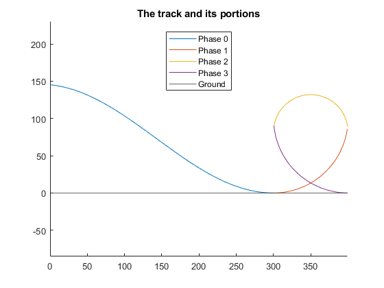

# Dynamics Final Project - Roller Coaster Loop

## Olivia Jo Bradley - Spring 2021

For this project, I created a simulation of a roller coaster loop. Roller Coaster loops are
not perfectly circular due to the amount of force the rider would experience. I
researched what the correct shape is, a clothoid, and modeled it with semi and quarter
circles. Below is a graph of the phases.

